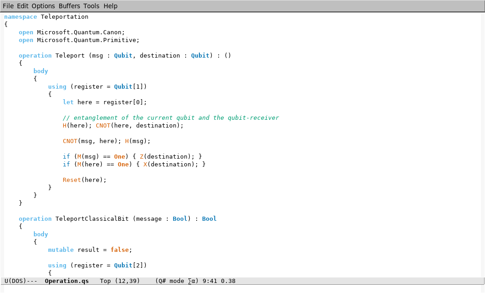

This is just the syntax highlighting, yes.

# Installation

## ELPA and MELPA

Package management via `package.el` is allowed (thanks to [anuragm](https://github.com/anuragm)):

```lisp
(use-package qsharp-mode
  :quelpa
  (qsharp-mode :fetcher github :repo "forked-from-1kasper/emacs-qsharp-mode")
  :commands qsharp-mode
  :mode (("\\.qs$" . qsharp-mode)))
```

## Manual installation

1. Clone this repo to `~/.emacs.d/qsharp-mode/`:

    ```bash
    git clone git://github.com/forked-from-1kasper/emacs-qsharp-mode`
    ```

2. Add the following to your `init.el`:

    ```lisp
    (add-to-list 'load-path "~/.emacs.d/qsharp-mode/")
    (autoload 'qsharp-mode "qsharp-mode" "Major mode for editing Q# code." t)
    (add-to-list 'auto-mode-alist '("\\.qs$" . qsharp-mode))
    ```

3. ???

4. PROFIT!

# Screenshot


